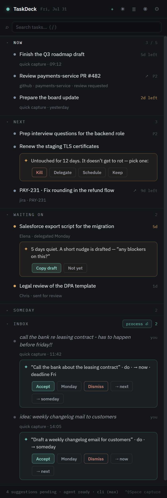

# TaskDeck

**An inbox with a brain.** A slim, always-on-top task deck for one edge of your screen —
near-zero-friction capture plus an AI triage partner that proposes structure, priority, and
follow-ups. It only ever *proposes*; you approve with one click.

[](https://github.com/TSchmiedlechner/TaskDeck/actions/workflows/ci.yml)
[](LICENSE)

<p align="center">
  
</p>

## Why another todo app?

Because every todo tool dies the same two deaths:

1. **Capture friction kills adoption.** Any tool that demands a project, priority, or due
   date at capture time loses to Notepad, which is instant.
2. **Lists become graveyards.** Nothing is ever removed, "today" quietly grows to forty
   items, the list outgrows your trust, and you abandon it.

TaskDeck's bet: storage was never the problem — **triage** was. What's missing from every
tool is the ongoing *editorial* work: structuring raw brain-dumps, keeping today short,
chasing the things you delegated, confronting you about entries that are rotting. That is
exactly the work an LLM can now do continuously. So TaskDeck pairs instant capture with an
AI editor — one that suggests, never rearranges. Every AI action is a visible chip you
accept or reject with one click. It's a colleague, not a poltergeist.

## What it does

- **Capture anything, instantly.** `Ctrl+Shift+Space` opens a spotlight anywhere in
  Windows. Type half a sentence, paste a whole email — Enter, done. No fields, ever.
- **AI triage in the background.** New captures are batch-triaged into proposals: a clean
  title, a type (do / decide / delegate / waiting), a bucket, priority, deadline, owner.
  Each proposal is a one-click accept/reject chip, and rejections feed back into later
  prompts so the triage learns your taste.
- **A list with opinions.** *Now* is hard-capped (default 5) and the deck defends the cap —
  when it overflows, it proposes what to demote. Below it: *Next*, *Waiting on*,
  *Someday* (collapsed), and the *Inbox*.
- **Nothing gets to rot.** Items untouched past the staleness threshold are confronted:
  **kill / delegate / schedule / keep**. No silent graveyard.
- **Chase nudges.** Quiet *Waiting on* entries get a drafted follow-up ("any blockers on
  this?") ready to copy, with the owner and days-waiting tracked.
- **Morning briefing.** On the first interaction of the day: today's meetings, what needs
  attention, and a proposed *Now* set you can accept in one click. Falls back to a
  deterministic briefing when offline.
- **Pulls work from where it lives.** Flagged Outlook mails, Teams messages you react 👀
  to, GitHub PRs waiting on you, Jira issues assigned to you — all land as inbox
  candidates you triage like anything else. All read-only (write-back is a separate
  opt-in toggle).
- **Invisible on screen shares.** Content protection is on by default — the deck and the
  capture spotlight don't appear in screen shares or recordings.
- **Local-first.** Your data is a SQLite file on your machine. No accounts, no sync
  backend. Only the AI calls leave the machine.
- **Honest about cost.** Every AI call's tokens and cost land in a monthly counter in
  Settings.

## Getting started

Grab the installer from [Releases](https://github.com/TSchmiedlechner/TaskDeck/releases),
or build it yourself (below).

> [!NOTE]
> The installer is **not code-signed**, so Windows SmartScreen will warn you on first
> launch — click *More info → Run anyway*, or build from source if you'd rather not trust
> a random exe from the internet (fair).

TaskDeck lives in the tray: closing the deck window hides it, and the tray menu has
Show deck / Quick capture / Morning briefing / Quit. Start-with-Windows is on by default
(Settings → Behavior), and the capture hotkey is configurable there too.

For the AI brain you need one of two things: a logged-in [Claude Code](https://claude.com/claude-code)
CLI (calls are covered by your subscription) or an Anthropic API key (pay per token).
Without either, capture and the list still work — there's just no triage. The Outlook,
Teams, GitHub, and Jira integrations are optional; [MANUAL-SETUP.md](MANUAL-SETUP.md)
walks through the accounts, tokens, and consents each one needs.

### Build from source

```powershell
npm install
npm run dev        # development with hot reload
npm run build      # production build to out/
npm run dist       # build the Windows installer to dist/TaskDeck Setup x.y.z.exe
npm run typecheck  # tsc over main+preload and renderer
npm test           # vitest unit tests
```

## Keyboard

| Key | Where | Action |
| --- | --- | --- |
| `Ctrl+Shift+Space` | global | quick capture |
| `C` | deck | quick capture |
| `B` | deck | morning briefing |
| `T` | deck | triage mode (keyboard-first inbox processing) |
| `A` / `S` | deck | activity log / settings |
| `A` / `Z` / `D` | triage | accept / monday / dismiss |
| `/` | deck | search |
| `Esc` | anywhere | close overlay / dismiss capture |

## Agent backends

The brain is provider-pluggable (Settings → Agent → Provider):

| Provider | Auth | Billing | Notes |
| --- | --- | --- | --- |
| `cli` | logged-in Claude Code (`claude` on PATH) | covered by your Max plan | headless `claude -p --output-format json`; schema prompt-enforced + Zod-validated with one retry |
| `api` | API key | pay per token | schema enforced by the API (`output_config.format`) |
| `auto` (default) | — | — | prefers `cli` when available, else `api` when a key is set, else offline |

The API key can be entered on the Settings page (stored encrypted via Windows DPAPI /
`safeStorage`) or provided via the `ANTHROPIC_API_KEY` environment variable; a
settings-stored key wins. CLI calls strip `ANTHROPIC_API_KEY` from the child environment
so they always bill against the subscription, never the key. Triage and briefing models
are selectable in Settings (defaults: Haiku 4.5 for triage, Opus 5 for the briefing).

## Integrations (all read-only unless noted)

| Source | What lands in the deck | Setup |
| --- | --- | --- |
| Outlook mail | flagged inbox mails → AI-triaged candidates (flag it = put it on the deck) | Microsoft sign-in (device code, no app registration — see [MANUAL-SETUP.md](MANUAL-SETUP.md)) |
| Outlook calendar | today's meetings in the briefing | same sign-in |
| Teams | chat messages you react 👀 to → candidates (react = put it on the deck) | same sign-in (toggleable) |
| GitHub | PRs awaiting your review → *do*; your open PRs → *waiting on* | fine-grained PAT |
| Jira | open issues assigned to you → candidates (with due dates) | site + email + API token |
| Write-back (opt-in) | completing a mail item completes the flag (and marks the mail read) in Outlook | Settings toggle |

Integration candidates are deduped by source id, tombstoned when dismissed (they stay
gone), and auto-removed while untriaged once handled at the source (mail: unflagged;
Teams: un-reacted). Structured sources (GitHub, Jira) get deterministic proposals with no
AI cost; mails and Teams messages go through AI triage.

## Architecture

```
src/shared    types + display helpers (contract between processes)
src/main      Electron main: windows/hotkey, node:sqlite store, scheduler, Anthropic brain, IPC
src/preload   contextBridge → window.taskdeck
src/renderer  React deck UI (index.html) + capture spotlight (capture.html)
```

- Data is local SQLite (via Node's built-in `node:sqlite`) in `%APPDATA%/taskdeck/taskdeck.db`.
- The **scheduler** debounces new captures into one batched Haiku call and runs the
  deterministic scans (staleness, chase, Now overflow) locally at no API cost.
- All mutations go through the main process; renderers are stateless views over
  `state:get` + a `state-changed` push.
- Every capture, proposal, accept/reject, and move lands in an activity log — the deck
  can always answer "why is this item here?".

The original [design brief](taskdeck-design-brief.md) has the full reasoning behind the
product decisions.

## Development

GitHub flow: feature branches → PR against `main` (CI runs typecheck + tests + build) →
merge. To release: bump `version` in `package.json` (via PR), then tag `vX.Y.Z` — the
Release workflow builds the Windows installer and publishes it as a GitHub release.

## Contributing

TaskDeck is a personal tool I use every day, and it's opinionated by design — the hard
*Now* cap, the propose-don't-act AI, and the anti-graveyard confrontations are the point,
not accidents. Bug reports and PRs for fixes or polish are very welcome. For new features,
please open an issue first so we can talk it through before you invest time — I'd rather
say "not a fit" to an issue than to a finished PR.

## License

[MIT](LICENSE)
